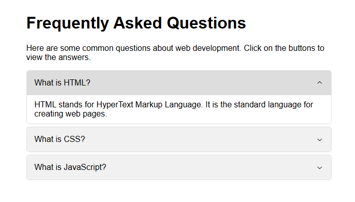

# Accordion-UI

An accordion component that displays a list of questions or headings. When a user clicks on a question, its corresponding answer or content section will expand while collapsing any previously opened section. This allows only one section to be open at a time, keeping the UI clean and organized.

# Restricted Textarea

